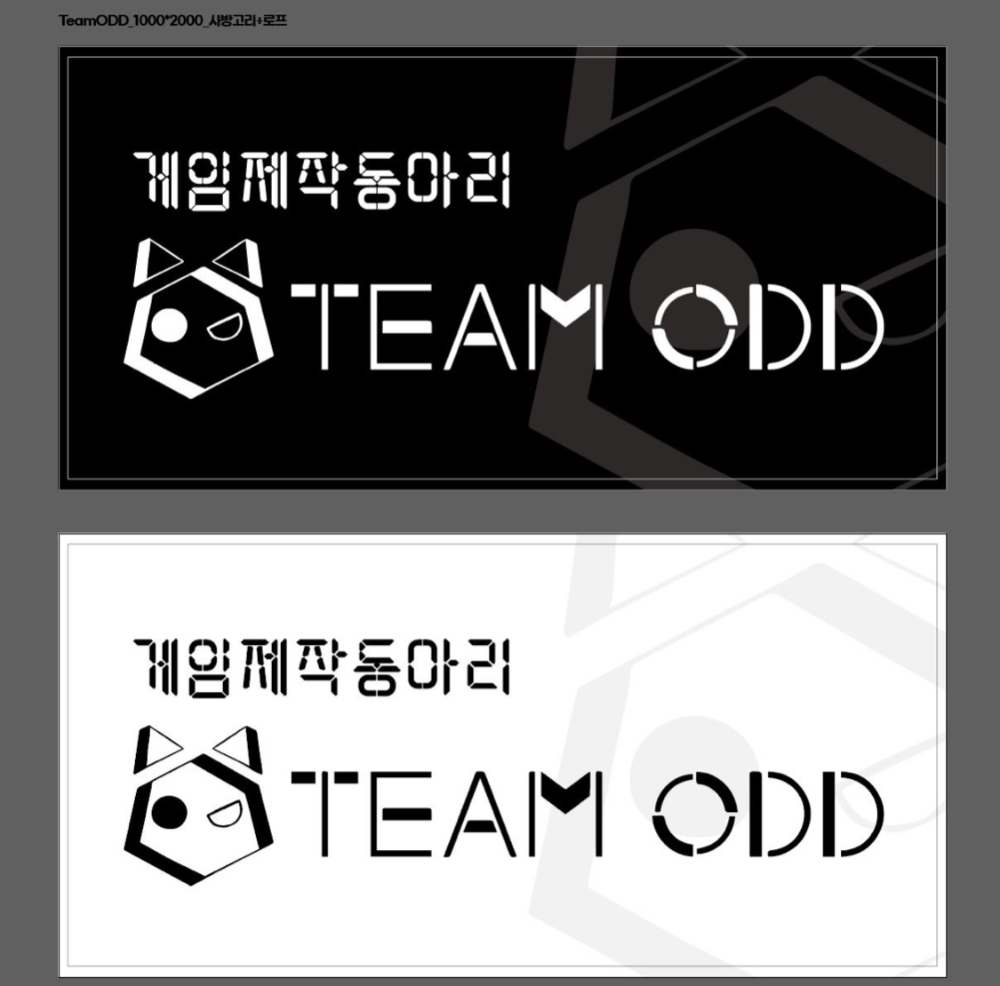
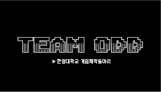
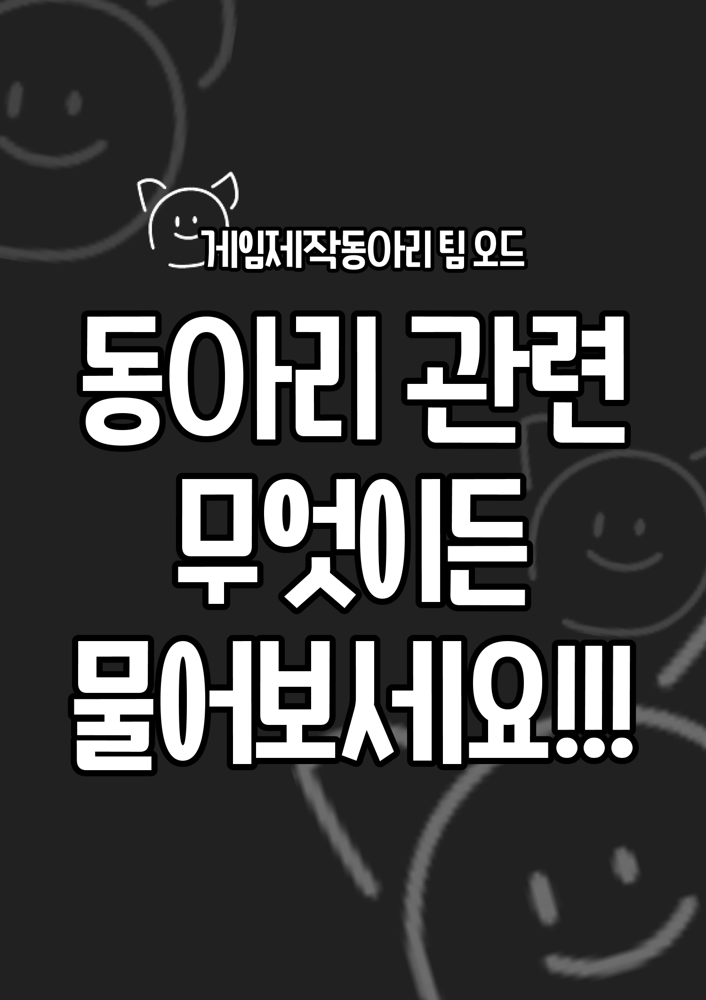
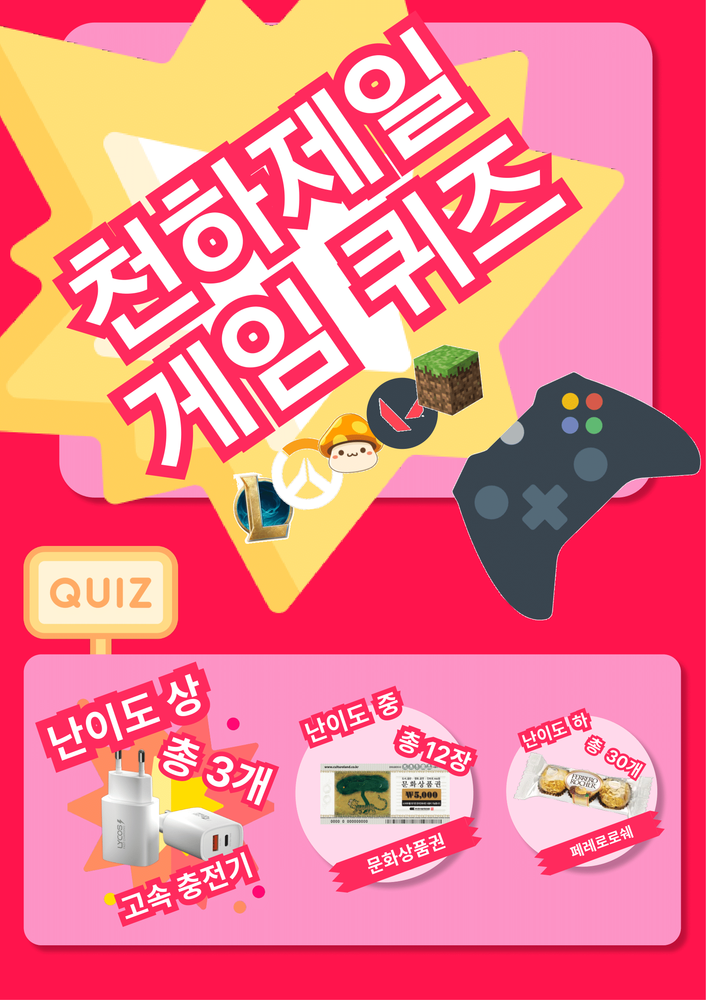

# 동아리 박람회

# **2022-09-14 동아리 박람회 결산**

## **진행 방식**

- 기간
    - 2022-09-14(오후 3~6시)
- 동아리 박람회 부스 위치
    - 상상관 쪽 부스 중 오른쪽 끝(박람회 시작 초반에 사람이 몰린다.)

### 부스 컨텐츠 준비

- 참여형
    - 퀴즈 게임을 제작하여
- 설명형
    - 동아리 관련 질문을 할 시 동아리 내에서 진행하는 프로젝트 등과 관련지어 대답을 함
- 전시형
    - 명함을 제작하여 사람들이 기호에 따라 가져갈 수 있도록 함
- 이외에도 포스터 등을 제작하여 부스에 게시함
### 동아리 전시형 및 포스터 등등 제작 결과

- #### 동아리 부스 현수막 결과물


- #### 동아리 부스 명함 결과물
<figure class="half">
    
    
</figure>


- #### 동아리 부스 포스터 결과물

<figure class="half">
    
    
</figure>

### 참여형 퀴즈 게임 방안

#### 퀴즈 방식

- 난이도 단계별로 문제를 풀도록 하고 푼 문제의 상품을 가져가는 방식
    - 문제 맞추기를 성공하면 해당 난이도의 상품을 증정하는 방식

#### 퀴즈 상품

방문객 60명 기준으로 준비

- 참여상
    - 멘토스 3~4알 + 하리보(소) 한 봉 + 치즈맛 오트밀 미니바이트
        - 위 구성을 한세트로 100세트 구비
        - 각각 대용량 구매 후 소분하여 참여상으로 증정
        - 하리보 10980원 100봉
        수량 : 1개
        오프라인 구매
        - 멘토스 어쏘티드 후르티 믹스 6900원
        수량 : 1개
        - 오트밀 치즈 미니바이트 과자 14380원
        수량 : 1개
        - 봄91 SR 반투명 접착식 쿠키봉투 소 5350원
        수량 : 1개
        - 총 37610원
- 난이도별 상품
    - 보통
        - 페레로로쉐 3구 10개 세트 20900원
            - 3세트
            - 62700원
    - 어려움
        - 문화상품권 5000원
            - 12장
            - 60000원
    - 아주 어려움
        - 고속충전기 약 10000원
            - 3개
            - 30000원

#### 퀴즈 문제 구성

- 분량 문제로 맨 하단에 기술

### 동아리 박람회 결산

- 박람회 참여 인원이 생각보다 많았다.
    - 코로나 상황임에도 100~150명 방문
    - 참여상 100세트 전량 소진
    - 난이도 보통 상품(페레로로쉐)
        - 시작 후 1시간 30분 경 전량 소진
    - 난이도 어려움 상품(문화상품권 5000원)
        - 시작 후 2시간 경 전량 소진
    - 난이도 아주 어려움(고속충전기 10000원)
        - 2개 남음
- 다만 사람들도 즐겁게 참여하신 것 같다.
- 후반부에 상품이 떨어져 받지 못하더라도 참여하시는 분들도 많았다.

### 타부스 진행 방식

- 퀴즈형
    - 우리 부스와 비슷하게 퀴즈형 방식
- 게임 체험형
    - 자신의 동아리 분야에 맞는 vr 게임을 체험하게 해주는 방식
- 미니게임형
    - 통아저씨
    - 복불복 악어이빨
    - 위 미니 게임들을 이기면 상품을 주는 방식
- 기타
    - 참여자가 직접 노래
    - 참여자가 직접 댄스
### 기타 의견
- 향후에는 대전형으로 간단한 게임을 만들고 둘이서 경쟁하도록 하여도 좋을 듯 하다.[오프라인이든 온라인이든]
  - 경쟁하여서 이긴사람한테 소정의 상품을 주는 방식으로 하는 것도 좋을 것 같다.
- 2022년 이후 방역이 더욱 완화되면 적어도 이번 보다는 더 많은 사람들이 방문할 듯 하다.
- 이번에는 이틀이었던 박람회 기간이 하루로 줄어서 상품 수량 크게 부족하지는 않았으나 이후 이틀로 진행하게 될 경우 상품 수준을 낮출 필요가 있다.

### 퀴즈 문제 구성

```markdown
롤
다음 스펙을 듣고 아이템을 맞추시오.[공격력 25, 쿨타임 감소 10%, 방어구 관통력 10, 가격 1337원]/야만의 몽둥이
다음 스펙을 듣고 아이템을 맞추시오.[주문력 95, 체력 100, 이동속도 10%, 가격 1600원]/메자이의 영혼약탈자 25스택
하
드레이븐과 형제인 챔피언은?다리우스
리그오브레전드를 만든 회사 이름은?라이엇
마스터이가 사용하는 검술 이름은?우주류 검술
공허출신 챔피언 이름을 5개 대시오./벨코즈, 스카너, 카직스, 카사딘, 코그모, 카이사, 말자하, 초가스, 렉사이, 벨베스
오공의 스승은?마스터이
탈리야의 스승은?야스오
야스오의 형은?요네
요들 챔피언 이름을 5개 대시오 럼블, 룰루, 베이가, 유미, 코르키, 트리스타나, 티모, 나르, 아무무, 벡스, 뽀삐, 직스, 케넨, 클레드, 피즈, 하이머딩거
가렌과 연인관계인 챔피언은?카타리나
자운 출신 챔피언 이름을 5개 대시오./레나타 글라스크, 문도 박사, 블리츠 크랭크, 빅토르, 신지드, 에코, 우르곳, 워윅, 자크, 잔나, 제리, 직스, 징크스, 트위치
프렐요드의 3명의 반신(반만 신)인 챔피언은?오른, 볼리베어, 애니비아
브라움의 방패는 원래 어떤 용도의 물건이었을까요?문짝, 금고문
칼바람나락에서는 눈덩이를 던질 수 있는 스펠이 있는데요, 이 스펠의 이름은 무엇일까요?표식
점멸의 쿨타임은?300초
점화의 쿨타임은?180초
회복의 쿨타임은?240초
피즈의 E스킬 이름은?재간둥이
별의 아이라는 이명을 가진 챔피언은 누구일까요?소라카
제드를 픽할 시 나오는 대사는?보이지 않는 검이 가장 무서운 법
세주아니가 타고 다니는 돼지 이름은?브리슬
자크의 대사중 흔히 “뚜루뚜 빠라빠라”라고 알려진 대사는 정확히 뭐라고 하는 것일까?두눈 똑바로 떠라

중
협곡에서 나서스의 Q스킬로 대포미니언을 처치하면 몇 스택이 쌓일까요?12스택
시즌1 승리의 스킨은?승리의 자르반
룬테라 남서쪽에 위치한 왕국으로, 공허의 균열이 생긴 곳의 이름은?이케시아
이즈리얼 스킬 이름 2개 대시오./끓어오르는 주문의 힘, 신비한 화살, 정수의 흐름, 비전 이동, 정조준 일격
현재 롤에 존재하는 강타의 이름 2개를 대시오./혹한의 강타, 승부의 강타
[보기: 1. 도미닉 경의 인사 2. 라일라이의 수정홀 3. 루난의 허리케인 4. 나보리 신속검 5. 세릴다의 원한] 다음 중 라이엇 개발진의 닉네임이 포함 된 아이템을 고르시오./3
벨코즈를 픽할 시 나오는 대사는?해체하여 지식을 습득한다
카직스와 렝가가 다른 팀으로 만났을때 등장하는 특별임무 이름은?사냥시작
징크스의 본명은?파우더
토큰 몇 개로 수수께끼 감정표현을 구매할 수 있는가?60개
바이의 이름은 라틴어인데 뜻은?힘
롤 최초의 오드아이 챔피언은?조

상
다음 스펙을 듣고 아이템을 맞추시오.[공격력 25, 쿨타임 감소 10%, 방어구 관통력 10, 가격 1337원]/야만의 몽둥이
다음 스펙을 듣고 아이템을 맞추시오.[주문력 95, 체력 100, 이동속도 10%, 가격 1600원]/메자이의 영혼약탈자 25스택
탈진의 효과는 3초 동안 이동속도를 [--]%느리게, 가하는 피해량을 [--]% 낮춘다./30, 35
그레이브즈가 녹턴에게 W를 맞추면 출력되는 특수대사는?이제 누가 장님이지?
카사딘의 이름의 뜻은?사막이 인정하는 자 누구인가?
샤코의 이름은 특정 단어를 애너그램한 것인데 그 단어는?카오스, 혼돈
팝스타 아리가 컨트롤 + 3을 통해 추는 춤은?소원을 말해봐
벨코즈의 성장공격력을 소수점 6째 자리까지 말하여라./3.141592, 원주율임
인터넷 브라우저 이름을 딴 4개의 스킨이 있는데, 그 중 3개의 이름을 대라./탐험가 이즈리얼, 불여우 아리, 사파리 케이틀린, 크롬 람머스
2017 롤드컵 삼성갤럭시 우승팀의 스킨들은 한국을 대표하는 심볼들을 모티브로 하였는데, 어떤 것을 모티브로 하였는지 3개를 대라./백호, 이순신, 화랑, 홍길동, 까치
란두인 부인의 닉네임이자 롤아이템의 이름이 되기도한 아이템의 이름은?슈렐리아의 군가
하이머딩거의 E스킬의 이름은?CH-2 전자폭풍 수류탄
가격이 BE 3150원인 챔피언 5명을 말하시오./갈리오, 신짜오, 트런들, 쉔, 갱플랭크, 르블랑, 블라디미르, 올라프, 우르곳, 카서스, 코르키, 트위치, 볼리베어, 쉬바나, 블리츠크랭크, 그라가스, 샤코, 아칼리, 카사딘, 카타리나, 하이머딩거
스카너 수정 근처에 있으면 어떤 버프를 받는가?공격속도와 이동속도 증가, 초당 최대마나의 2% 회복

옵치
하
토르비욘의 딸의 이름은?브리기테
오버워치 세계관에서 인공지능 기계 생명체의 명칭은?옴닉
솔져76의 우클릭 기술 이름은?나선 로켓
바스티온 일반모드의 장탄수는 얼마인가?35발
자리야 방벽의 최대 피해 흡수량은 얼마인가?200
아군 캐서디가 궁을 쓸 때 하는 대사는?앞으로 나오시지
아군 겐지가 궁을 쓸 때 하는 대사는?용이 내가 된다!
둠피스트의 보호막 생성 조건은?스킬로 피해를 줄 때,보기: 철권포, 로켓펀치, 지진강타, 라이징 어퍼컷
둠피스트의 보호막 생성 최대량은?150
캐서디의 헤드샷 타격 데미지는?140
라인하르트 방벽의 내구도는?1600
라인하르트가 화염강타를 적 1명에게 맞췄을 때의 궁게이지 최대 증가량은?7%
융화를 사용하는 영웅의 이름은?모이라
리퍼 E스킬의 이름은?그림자 밟기
위도우메이커 궁극기 대사"Personne n'échappe à mon regard"의 뜻은?아무도 내 눈에서 벗어날 수 없어
메이가 가지고다니는 기후조절 드론의 이름은?설구
메이의 원래 직업은?남극탐사기지 연구원,기후학자,과학자
겐지 스승의 이름은?젠야타
메르시의 본명은?앙겔라 치글러
아군 시메트라의 궁극기 대사는?현실은 내 뜻대로 움직여요!
브리기테가 사용하는 무기의 이름은?로켓 도리깨
윈스턴에게 과학을 가르치며 보살폈던 연구원의 이름은?해롤드 윈스턴
디바의 소꿉친구 이름은?박대현
오버워치1에서 처음으로 추가 출시된 캐릭터는?아나 아마리
자리야 방벽 한번으로 얻을 수 있는 최대 에너지량은?40

중
정크랫이 사망 시 떨어트리는 폭탄 갯수는?6개
루시우는 벽을 탈 때 이동속도가 증가하는 패시브가 있다. 이동속도는 몇 퍼센트 증가하는가?30
솜브라 해킹의 지속 시간은?5초
리퍼의 본명은?가브리엘 레예스
위도우메이커의 줌 배율은?2.5배
아나의 줌 배율은?2.5배
애쉬의 줌 배율은?2배
브리기테의 국적은?스웨덴
위도우메이커에게 암살당한 옴닉지도자의 이름은?테카르타 몬다타
오리사가 사용하는 총의 이름은?융합 기관포
윈스턴의 공격속도는?초당 20발
훈련장 공격 로봇은 한번 공격 할 때 총 몇번의 발사를 하나요?7번
솔져의 생체장은 초당 얼마씩 회복하나요?35HP
레킹볼 안의 햄찌의 본명은?해먼드
오버워치에 가장 많은 영웅을 보유중인 국가는?미국
겨울 전용 맵이 있는 전장을 3개 말하세요./하나무라, 블리자드 월드, 왕의 길
시메트라 무기가 한 단계 충전(강화)되기까지 걸리는 시간은?1.4초
둠피스트의 건틀렛을 운반하는 화물맵은?눔바니
네팔 맵 중 겐지와 한조의 투샷이 있는 장소는?네팔 마을 맵 거점지역 바로 옆 2층
파리 맵 공격팀 전투준비실 내 노래부르는 옴닉의 머리에 있는 깃털의 개수는?3개
캐서디 단편 애니메이션 "재회"에서 처음에 캐서디가 먹는 음식 이름은?애플파이(사과파이)
할리우드 화물차 뒤 번호판에는 워라고 쓰여있는가?IM RICH
루시루의 소리파동(우클릭)의 최대거리는 몇 M 인가?7

상
오버워치1 출시 당시 기본 캐릭터 수는?21명
윈스턴은 실험체 시절 몇 번째 실험체였는가?28번째 실험체
정켄슈타인의 복수에서 캐서디가 궁극기 사용시 사용하는 특수 대사는?너희 창조주 곁으로 돌아갈 시간이다
솜브라 궁극기 대사"Apagando las luces!"의 뜻은?불 끈다!
라인하르트 스승의 이름은?발데리히 폰 아들러
브리기테의 풀네임은?브리기테 린드홀름
로드호그의 몸무게는?250kg
에코의 스킨 개수는?13개
파라의 영어 스펠링은? Fareeha
아누비스 맵의 공격팀 지점에 울음소리가 나는 이스터에그가 있는데, 그 이스터에그의 발동조건을 설명하시오./파란 개구리의 눈알을 쏜다 멀록

메이플
하
가장 최근에 출시 된 캐릭터의 이름은?라라
메이플스토리의 화폐 이름은?메소
메이플스토리 디렉터의 이름은?강원기
루타비스에서 잡을 수 있는 보스 4명의 이름은?반반, 블러디 퀸, 피에르, 벨룸
악마의 나무라는 이명을 가진 몬스터는?자쿰
키네시스의 출신지는 어디일까요?서울
전사 전직관의 이름은?주먹펴고일어서
모험가는 크게 몇가지의 직업이 있을까요?5가지
플레이어 중 최초로 200렙을 달성한 유저의 닉네임은?타락파워전사
시그너스 전직관의 이름 3개를 대시오./오즈, 미하일, 이리나, 이카르트, 호크아이
경험치 획득량을 증가시켜주는 비숍의 버프를 대시오./홀리 심볼
메이플스토리 최초 스켈레톤 애니메이션이 적용된 보스는?우르스
메이플 출시년도는?2003년도
모험가 출시 당시 초함되어있지 않던 직업군은?해적
메이플닉네임 최대 글자 수는?6자
공마 10%를 올려주는 와일드헌터의 버프 이름은?하울링
메르세데스 120레벨을 달성하여 얻을 수 있는 링크스킬의 효과는?경험치 15퍼센트 추가 부여
데일리기프트 최종 보상은?블랙큐브교환권
펜텀이 스킬을 훔칠 수 있는 직업군의 종류는?모험가
에레브의 전 여제는?아리아
빅토리아 아일랜드의 마을 이름 6개를 대시오./커닝시티, 리스항구, 헤네시스, 엘리니아, 노틸러스, 페리온
캐시아이템을 메소로 구매할 수 있는 서버는?리부트서버

중
빅토리아 선착장에서 갈 수 있는 대륙을 모두 말하시오 에레브, 에델슈타인, 오르비스
메이플스토리의 메이플은 어떤 뜻일까? 영웅 캐릭터 이름의 앞글자
궁극의 모험가 달성시 얻을 수 있는 스킬 3개를 대시오 소울 드라이버, 플레임 기어, 윈드 피어싱, 뱀파이어, 샤크 웨이브
메이플 세계여행 당시 있었던 지역 3개를 대시오 대만, 일본, 중국, 태국
스킬 스탠스를 가지고 있는 직업 4개를 말해라 히어로, 팔라딘, 다크나이트, 배틀메이지
높은 장소를 많이 가면 받을 수 있는 칭호 이름은? 높은 곳에 서본 자
장로 스탄의 아들 이름은? 알렉스, 제이
데일리기프트 9월 23일차 보상은? 스페셜 명예의 훈장
장로 스탄의 아내 둘의 이름은? 밍밍부인, 안나
슬리피우드에 있는 사우나 주인의 이름은? 시워언해
에반이 처음 갖고 시작하는 무기 이름은? 돼지치기 막대

상
강원기 디렉터가 가장 최근 라이브에서 먹은 음식은?소갈비찜
리버스시티에서 처음 등장한 t-boy 의 본명은? 니키
마가티아에 대립중인 두 세력의 이름은? 제뉴미스트, 알카드노
메이플에 존재하는 몬스터지우개의 종류를 모두 말하시오./루팡, 슬라임, 스텀프, 레이스, 옥토퍼스, 머쉬맘
리스항구의 NPC 존이 얻어달라고 하는 꽃으로, 끈기의 숲에서 얻을 수 있는 꽃의 이름은? 핑크 비올라, 그냥 비올라도 인정
스토리모드를 제외한 스우 레벨은? 210
몬스터컬렉션에서 유일하게 지휘관 이름이 들어간 엘리트몬스터는? 최상, 마법저항의 지휘관 수상한 물개

마인크래프트
하
마인크래프트 기본 캐릭터의 이름은 무엇입니까?스티브
마인크래프트의 보스[엔더 드래곤]이 있는 공간의 이름은 무엇입니까?(하, 엔더 월드)
흑요석을 만들기 위해서는 어떻게 해야하나?용암에 물을 부어준다.
지옥문의 재료는 무엇인가?라이터와 흑요석
마인크래프트 기본 캐릭터 중 어깨가 비교적 좁은 캐릭터의 이름은?알렉스
마인크래프트 난이도 수는?4개 쉬움, 보통, 어려움, 평화로움
손으로 열 수 없는 다락문은?철 다락문
말린 켈프를 먹으면 허기가 몇 칸 차는가?0.5칸
삼지창을 얻는 방법은?삼지창을든 드라운드를 죽인다.
한번 살아나게 해주는 아이템의 이름은?불사의 토템
인벤토리칸의 총 개수는?36칸
아이템을 버리는 방법중 엔티티가 바닥에 남지 않게 버리는 방법으로, 흔히 쓰이고 있는 이 방법을 두가지 말하시오./선인장, 용암, 엔더에서 버린다.
위더를 쓰러뜨리면 주는 것은?네더의 별
좀비의 체력은 몇 인가요?20

중
야생 서버에서의 건축 제한 높이는?384까지 건축 가능
오버월드와 지옥[네더월드]에서의 거리 비율에는 차이가 있다. 이 비율[예 - 1 : 2]은?1:8
위더를 쓰러뜨리면 주는 것은?네더의 별
말린 다시마 블록으로 구울 수 있는 아이템의 갯수는?20개
워든의 체력은?500
마인크래프트의 최대 밝기 레벨은?15
횃불이 낼 수 있는 최대 밝기는?14
심층암이 나타나는 고도는? Y값이 0보다 작을 때
아홀로틀을 길들이는 방법은?양동이에 담는다
꿀 블록이 있는 카테고리는?레드스톤
네더월드에 있는 네사체 두 종류의 이름은?뒤틀린, 진홍빛
독서대가 있는 카테고리는?레드스톤
가장 이름이 긴 블록은?밀랍칠한 약간 녹슨 깎인 구리 반 블록
껍질 벗긴 맹그로브 나무 원목의 색은?붉은기가 많이 도는 갈색(가깝게 말하면 통과)
머리에 착용하는 초록색 장비의 이름은?거북 등딱지
나무묘목의 개수는?6개 맹그로브 나무는 주아
케이크는 몇번 먹을 수 있는가?7번
레드스톤 횃불의 전력 레벨은?15
양털 색의 개수는?16개
초 색의 개수는?17개
4분짜리 감속물약을 만드는데 필요한 모든 아이템을 말하시오./네더 사마귀, 설탕, 레드스톤, 발효된 거미 눈
살충3의 효과는 무엇인가?대 벌레 피해량 7.5증가, 1~2.5초 동안 속도 감소4

상
나무[엔더월드, 지옥 나무 제외]의 이름을 모두 말하시오./참나무, 짙은참나무, 아카시아 나무, 정글나무, 자작나무, 가문비나무, 맹그로브 나무
위더장미는 어떻게 만들어지나요?위더가 몬스터를 죽였을 때 그 자리에 꽃이 핀다.
자수정이 자라나는 블록의 이름은?싹 틔우는 자수정
아이템 창 안에 있는 울타리 중, 유일하게 같이 정렬되어있지 않고 따로 떨어져있는 울타리가 있다. 이 울타리의 이름은?네더 벽돌 울타리
좀비의 플레이어 인식 범위는 몇 블럭 까지인가?35
스컬크 감지체는 주변에서 누군가 맞았을 때 어느 정도 수치의 레드스톤 신호를 내보내나요?5
드래곤의 숨결을 얻었을 때 깰 수 있는 도전과제는?양치질이 필요해 보이는 걸
생성기에서 한번에 최대 스폰할 수 있는 몬스터의 수는?4마리

발로란트
하
발로란트 요원의 수는?19
요루의 X스킬 이름은?차원표류
타격대의 수는?6
감시자의 수는?4
체임버 궁의 탄창 수는?5발
라운드 승리시 지급 받는 크레드는?3000
스펙터 + 오퍼레이터 – 고스트의 가격은?1600 + 4700 - 500 = 5800
아이스박스에 있는 로프의 개수는?5개
상대방(공격팀)이 아군의 사이트에 스파이크를 설치한 뒤 스파이크를 해체하러 가는 행위를 무어라 하는가?리테이크
아군을 부활시킬 수 있는 요원은?세이지
한국 출신 요원은?제트
유일하게 사이트가 세개인 맵의 이름은?헤이븐
소바의 빛나는 눈은 소바 기준으로 어느쪽 눈인가요?오른쪽
아군 레이즈 X스킬 대사는?파티를 열어볼까?!
아군 아스트라 X 스킬 대사는?세계가 분리된다!

중
발로란트를 시작할 때 처음으로 주는 플레이어 카드의 이름은?발로란트 카드
사이퍼의 국적은?모로코
레이즈를 픽할 때 나오는 대사는?그래 가는거야!
팬텀의 확대 배율은?1.25배
발로란트 인게임에서의1라운드 구매단계 시간은?45초
스파이크 해체 시 걸리는 시간은?7초
셰리프의 연사 속도는?4발/초
오퍼레이터의 확대 배율은?2.5배/5배
세이지 허리춤에 달려있는 구슬의 개수는?6개
체임버의 궁극기 포인트의 개수는?8
발로란트 요원들 줄 이름이 세글자인 요원은 몇 명인가?11~12(케이/오가 애매함)
플레이어 시점에서 보이는 체임버의 왼쪽 손목에 있는 것은?손목시계
레이나 궁 지속 시간은?30초
발로란트의 출시 연도는?2020년 6월 2일
최고의 야전 사령관으로 불리는 요원은?브림스톤
자동 속사 산탄총은?저지
레이나의 신발 색은?금색
아스트라의 왼쪽 귀에 있는 귀걸이(피어싱)의 개수는?3개
체임버의 신발 색은?흰색
"구매합시다. [        ] 아껴둡시다"빈칸에 들어갈 알맞은 말은?여유 크레드가 있습니다.
체임버 랑데부 스킬 시 던지는 카드의 색상은?청록색(초록색 가능)

상
체임버 궁의 연사속도는?1.176발/초
어센트 벽에 그려져있는 문어가 들고 있는 것은?열쇠
어센트 의자에 있는 롤 캐릭터의 이름은?탐켄치
어센트 피자가게에 나와있는 피자조각의 수는?6개
발로란트의 최초 발표일은?2019년 10월
(발로란트 공식 무기고 정보 피셜)인내심 있는 사수의 손에서 빛나는 총은 무엇인가?가디언 
네온 일러스트에서 프렌지의 총기장식으로 무엇이 달려있나요?문어
하스스톤[비활성화]
전설 등급 첫 달성시 획득할 수 있는 보상은? ( 하, 카드 뒷면 )
투기장에 참가하기 위해 필요한 골드는? ( 하, 150골드 )
하스스톤의 영웅 개수는? ( 하, 10개 )
하스스톤 컨텐츠 중 하나인 투기장의 최대 승리 수는? ( 하, 12승 )
각 직업별 최고 레벨은? ( 하,60레벨 )
턴이 끝날 때마다 8 데미지의 불덩이를 무작위 적에게 쏘는 카드의 이름은?(중, 라그나로스)
하스스톤 확장팩 '대 마상시합'의 출시년도는? ( 중, 2015년 )
하스스톤에서 대상의 체력을 남기지 않고 처치했을 때 추가 효과를 부여하는 효과의 명칭은?( 중, 명예의 일격 )
황금 희귀카드의 제작 비용은? ( 중, 800가루)
하스스톤에서 나온 모든 확장팩의 수는? (상, 21개)
하스스톤에서 소환 가능한 하수인 중에 가장 공격력이 높은 하수인의 공격력은?( 상, 30(고대의 존재)
하스스톤 게임 모드의 전체 개수는? Ex)정규전,전장 등 ( 상, 10개 )

철권[비활성화]
초풍 커맨드는 무엇인가?(상, 6n23+RP)
현재 철권에서 가장 높은 계급은 무엇인가?(하, Tekken God Omega)
공격하는 중간에 공격을 받아도 공격 모션이 멈추지 않는 기능은 무엇인가?(하, 파워 크러시)
붕권을 쓰는 캐릭터의 이름(풀네임)은?(하, 폴 피닉스)
격투 스타일이 태권도인 캐릭터의 이름은?(하, 화랑)
철권 세계관에서 세상을 지배하는 거대 기업 이름은?(중, 미시마 재벌)
몇몇 기술의 경우 가드하였을 때 맞은 캐릭터가 뒤로 밀려나게 된다. 이 현상을 무엇이라 부르는가?(중, 가드백)
철권에서 서있는 상태일 때 자동으로 막는 위치는 어디인가?(하, 상단, 중단)
상대의 공격보다 먼저 타격에 성공했을 때 ‘이 판정’으로 히트하게 된다. ‘이 판정’은? (하, 카운터)
철권에서 타격시 멀리 날아가는 기술은 무엇인가?(중 , 스크류)

스팀(포탈 시리즈, 폴가이즈, 마녀의 집, 스컬, 더 포레스트, 로보토미 코퍼레이션, 니어오토마타, 데드바이데이라이트)[비활성화]
폴가이즈 캐릭터들의 모티브는 무엇인가?(중, 젤리빈)
포탈1의 주인공은 누구인가? (중, 첼)
포탈2에서 글라도스는 ‘이것’으로 모습이 바뀌는 수난을 겪는다. ‘이것’은? (중, 감자)
공포게임 마녀의 집에서 주인공은 ‘이 꽃’ 때문에 숲에서 빠져나가지 못한다. ‘이 꽃’은? (중, 장미)
스컬에서 주인공의 실제 정체는 무엇인가?(중, 용사의 아들)
더 포레스트에서 주인공이 무인도에 고립된 원인은 무엇인가?(하, 9시 비행기 오작동으로 인해 불시착해서)
더 포레스트에서 주인공의 목적은 무엇인가?(하, 누군가 데려간 아들을 되찾는 것)
로보토미 코퍼레이션에서 관리하는 괴물들의 총칭은 무엇인가?(하, 환상체)
로보토미 코퍼레이션에서 괴물들을 관리하여 얻을 수 있는 물질의 이름은 무엇인가?(상, 엔케팔린)
로보토미 코퍼레이션에서 주인공인 A를 도와주는 비서의 이름은 무엇인가?(하, 엔젤라)
로보토미 코퍼레이션에 등장하는 환상체 중 하나인 역병의사의 실체 정체는?(상, 백야)
로보토미 코퍼레이션에 등장하는 환상체 중 푸른별은 무엇을 상징하는가?(상, 타칭 신)
니어오토마타에서의 적들의 명칭은?(하, 기계 생명체)
니어오토마타에서 주인공이 속한 부대의 이름은?(하, 요르하 부대)
니어오토마타에서 주인공이 속한 단체가 검은색 옷을 입는 이유는 무엇인가?(상, 인류에 대한 상복이기 때문)
데드바이데이라이트의 배경이 되는 희생제를 주최한 존재는 무엇인가?(하, 엔티티)
```

위 문제를 ScriptableObject로 변환하여 사용

운영 인원 : 김나연, 이우신, 김시언, 안진혁 ,송재욱, 박진한, 홍기표, 정보연